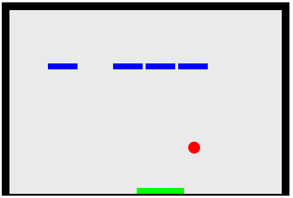

# Hola mundo de los videojuegos con javascript 

## Video tutorial 

[Tutorial youtube](https://www.rubenvelazquez.com)

## Como ejecutar el juego

Para ejecutar el codigo debes poner los archivos fuente en la raiz de un servidor http. Existe una extension de VScode para hacer, esto llamada [Live Server](https://marketplace.visualstudio.com/items?itemName=ritwickdey.LiveServer).

## Las partes que componen este videojuego 

- Metodo de render
- Gameloop
- Escenario
- Entidades
- Maquina de estados
- Controles
- Fisicas(colisiones)
- Logica del juego
    - Puntuacion
    - Vidas
    - Game over
- Multimedia
    - Texturas
    - Sonido

